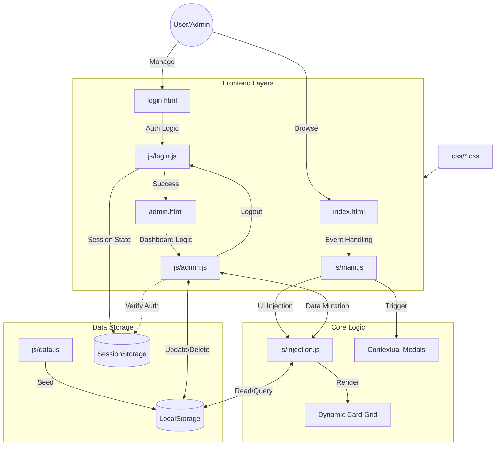

# 🎓 OpportuNEST - Unified Opportunity Portal

OpportuNEST is a streamlined web application designed to bridge the gap between students and career-building opportunities. It serves as a centralized hub for discovering **Scholarships**, **Internships**, and **Educational Events** with a seamless, interactive user experience.

---

## 🚀 Key Features

### **For Users**
- **🔍 Smart Filtering**: Instantly browse opportunities by category (Scholarships, Internships, or Events).
- **📝 Context-Aware Modals**: 
    - **Apply**: Custom scholarship and internship forms with motivation statements.
    - **Register**: Event-specific registration forms for delegates.
- **📱 Responsive Design**: Fully optimized for mobile, tablet, and desktop viewing.

### **For Administrators**
- **🔐 Secure Dashboard**: Protected login system for management tasks.
- **🛠️ CRUD Management**: Add, update, or remove opportunities in real-time.
- **💾 Persistent Data**: Built-in data synchronization using `localStorage`.

---

## 🏗️ System Architecture

The following diagram illustrates the application's data flow and component interaction:



---

## 🛠️ Tech Stack

- **Frontend**: HTML5, CSS3 (Custom Grid & Flexbox)
- **Scripting**: Vanilla JavaScript (ES6+)
- **Icons**: FontAwesome 7.0
- **Storage**: Web Storage API (LocalStorage & SessionStorage). (Temporary) 
- **Fonts**: System Interface Fonts (San Francisco/Segoe UI)

---

## 📂 Project Structure

```text
├── index.html          # Public landing & opportunity portal
├── admin.html          # Administrative dashboard
├── login.html          # Admin authentication page
├── css/
│   ├── general.css     # Base styles and typography
│   ├── card.css        # Opportunity card components
│   ├── modal.css       # Dynamic form overlays
│   └── ...             # Component-specific styles
├── js/
│   ├── data.js         # Initial mock data and schema
│   ├── injection.js    # DOM manipulation & card rendering
│   ├── main.js         # Public portal interactivity
│   └── admin.js        # Dashboard state management
└── assets/             # Images and static media
```

---

## ⚙️ Getting Started

1. **Clone the Repository**
   ```bash
   git clone https://github.com/Nishant7Adhikari/CSIT-PROJECT-FIRST-SEMESTER.git
   ```

2. **Run Locally**
   Simply open `index.html` in any modern web browser. No complex build tools or local servers required.

3. **Admin Access**
   - Navigate to the lock icon in the navigation bar.
   - Use the administrative credentials to manage the listings.

---

## � Project Team

- **Nishant Adhikari** — *Project Management, Debugging & Core JS*
- **Bishan Bartaula** — *Admin Panels & Administrative JS Logic*
- **Pasang Lama** — *Card UI, Display Layout & Dynamic Injection JS*
- **Prayash Adhikari** — *Registration & Application Modals*
- **Deepak Bashnet** — *Admin Login Interface*
- **Tilak Kunwar** — *Documentation*

---

## �📄 License

This project is licensed under the **MIT License**.

---
*Developed as part of the CSIT First Semester Web Development Project.*


